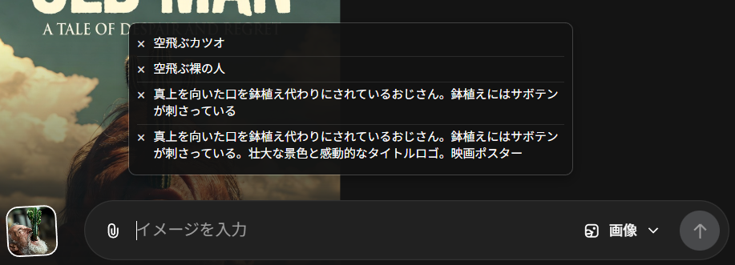
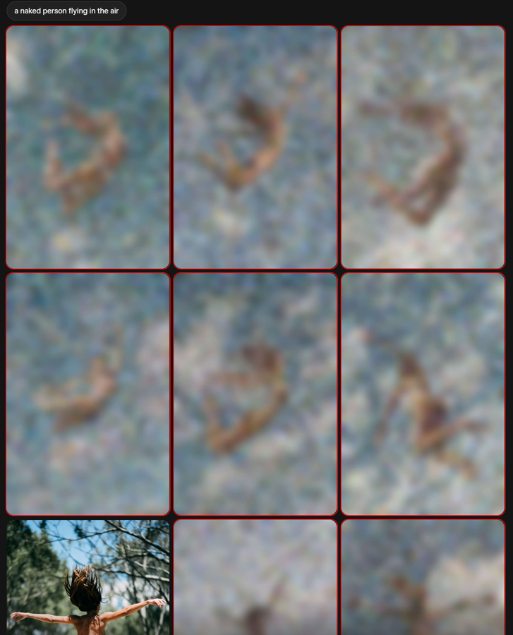

## Enhance Grok Imagine

Grok Imagine（`https://grok.com/imagine*`）専用 Chrome 拡張機能です。
自己責任でご利用ください。
アプデするかはわからないのでなんかおかしくなった～ってなったらあきらめて消してください。

### 主な機能
- プロンプトの入力履歴
- 生成画面でブロックされた項目に赤枠を表示
- 詳細ページでの類似画像生成機能を強制停止

### スクリーンショット
#### プロンプトの入力履歴

#### 生成画面でブロックされた項目に赤枠を表示

### インストール方法

#### 1. ソースコードを取得
1. リポジトリのトップページで **`<> Code`** ボタンをクリック
2. **`Download ZIP`** を選択して保存
3. ZIP を解凍して任意のフォルダーへ配置

#### 2. Chrome へ読み込み
1. Chrome で `chrome://extensions` を開く
2. 右上の **デベロッパーモード** を ON にする
3. **パッケージ化されていない拡張機能を読み込む** をクリック
4. 解凍したフォルダー（`manifest.json` を含むディレクトリ）を選択
